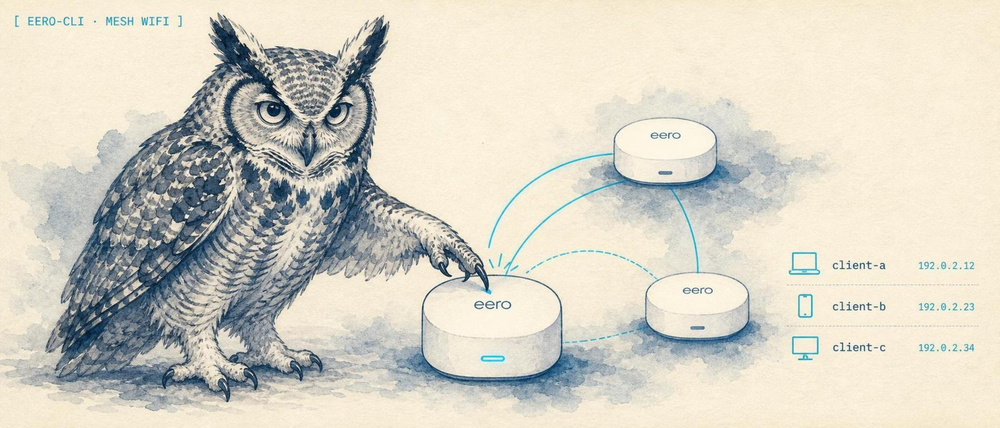

<p align="center">
  
</p>

<p align="center">
  <a href="https://lidless.dev"></a>
</p>
<h1 align="center">eero-cli</h1>

<p align="center"><strong>Tiny terminal CLI for managing devices on an eero mesh network from a real shell.</strong></p>

<p align="center">
  <a href="https://lidless.dev/eero-cli"><strong>Website</strong></a>
</p>

<p align="center">
  
  
  
</p>

## What it does

Wraps [`eero-api`](https://github.com/fulviofreitas/eero-api) (the most actively maintained reverse-engineered Python client as of May 2026) and adds:

- A two-step, **non-interactive** SMS auth flow that survives across separate shell invocations
- Filtered device listing (regex + MAC prefix + online/offline)
- Single and bulk device blocking, plus device rename
- Profile management: create profiles, assign devices, set bedtime schedules, block apps
- `--json` output on the read commands for scripting, and a read-only `status` check
- An honest writeup, in this README, of what eero's API will and won't let you do, so you do not spend half a day chasing unsupported calls

## Install

```bash
pipx install git+https://github.com/lidless-labs/eero-cli
# or, from a clone:
pipx install .
```

Requires Python 3.12+ (inherited from `eero-api`).

## Quickstart

```bash
eero auth +15551234567
eero auth --code 123456
eero devices
eero devices --offline
eero block-cleanup '^bc24'
```

## First-time auth

The eero API uses a two-step SMS/email login. Both halves are non-interactive so they work in any wrapper that can't drive `input()`:

```bash
# Step 1: trigger the SMS / email
eero auth +15551234567        # phone
# or
eero auth you@example.com     # email
# Step 2 (after the code arrives, within 30 minutes):
eero auth --code 123456
```

Session token is written to `~/.config/eero/session.json` (mode 0600). Re-run `eero auth` any time to start over.

### Why two steps

The underlying `eero-api` library auto-clears any persisted session whose `session_expiry` is None when it loads, but `login()` legitimately leaves expiry None until `verify()` runs. Single-process auth works fine; cross-process auth would lose the partial state on read. `eero-cli` works around this by stamping a 30-minute placeholder expiry between the two calls.

## Commands

```bash
eero status                       # auth state, account, visible networks (read-only)
eero status --json                # same, machine-readable (exit 1 if not signed in)

eero devices                      # list everything
eero devices --filter '^iphone'   # regex over nickname/hostname
eero devices --mac 'BC:24:11'     # MAC prefix
eero devices --offline            # only stale entries
eero devices --online             # only currently connected
eero devices --json               # JSON array instead of a table

eero rename <mac-or-id> 'Office AP'  # set a device nickname

eero block <mac-or-id>            # block a device (works on online devices)
eero block <mac-or-id> --unblock  # reverse it
eero block-cleanup '^bc24'        # bulk-block matching offline devices
eero block-cleanup '^bc24' -y     # skip confirmation prompt

eero profiles --devices           # list profiles and assigned devices
eero profile-create 'Johnny TV' # create a dedicated profile
eero profile-assign 'Johnny TV' 'Samsung' -y
eero profile-schedule 'Johnny TV' --start 21:00 --end 08:00 --days all -y
eero profile-schedule-clear 'Johnny TV' -y
eero profile-block-apps Johnny youtube --append -y
```

`block-cleanup` defaults to offline-only and skips already-blocked devices. Pass `--include-online` to widen the net.

Profile schedules are profile-level in eero, not per-device. To restrict a single
device without affecting a profile's other devices, create a dedicated profile for
that device and assign only it.

## What this CLI cannot do (and why)

The eero REST and GraphQL APIs **do not expose any mutating operation on offline devices**. We verified this end-to-end:

- `DELETE` on `/2.2/networks/<nid>/devices/<did>` returns `404` (also tested `/2.0/`, `/2.1/`, `/2.3/`, `/3.0/` API version prefixes; PATCH and OPTIONS too)
- `PUT` with `{"forget": true}` / `{"is_forgotten": true}` / `{"remove": true}` returns `200` but silently no-ops
- `POST` to `/devices/<id>/forget`, `/forget`, `/remove`, `/bulk_forget` all return `404`
- `block_device` against an offline device returns `200` but does not flip the `blacklisted`, `paused`, `dropped`, or any other state field
- The eero web admin SPA (`insight.eero.com`) ships **215 GraphQL mutations**; none match `*Forget*`, `*Delete*Device*`, or `*Remove*Device*` (only `BlockDevicesNetwork`, `EditDeviceNickname`, `EditDevicePaused`, `ToggleEeroBuiltinOnDevice`, `UnblockDevicesNetwork`, `UpdateDeviceSecondaryWan`)

The mobile app's "Forget Device" button must use either a private/internal channel or be local-only display state. None of the public reverse-engineered libraries expose device removal: [`343max/eero-client`](https://github.com/343max/eero-client), [`fulviofreitas/eero-api`](https://github.com/fulviofreitas/eero-api), [`schmittx/home-assistant-eero`](https://github.com/schmittx/home-assistant-eero), or [`erikh/eero`](https://github.com/erikh/eero).

**If you need to actually delete an offline device:**

1. Open the eero mobile app, tap the device, three dots → "Forget Device". Eero auto-culls truly stale entries after ~30 days, so doing nothing also works.
2. Or capture the real call via mitmproxy on your phone (left as an exercise; PR welcome if you find it).

## Development

```bash
pip install -e ".[dev]"   # pytest, ruff, mypy
ruff check .              # lint
mypy                     # type-check
pytest                   # unit tests (pure parse/filter/format logic, no network)
```

The tests cover the response-shape extraction, the device/profile match resolution
(including the "refuse to guess when ambiguous" safety path that guards destructive
commands), day/time validation, and the argparse command surface. CI runs all three
checks on every push and PR (`.github/workflows/ci.yml`).

## Underlying library

[`eero-api`](https://github.com/fulviofreitas/eero-api) by Fulvio Freitas is a modern async client, version 4.1.3 at time of writing. Picked over the older `343max/eero-client` (last code push Feb 2024) because it's actively maintained, ships proper file-based credential storage, and has a clean async surface.

## License

MIT. See [LICENSE](./LICENSE).

---

<p align="center"><a href="https://lidless.dev">Part of <strong>Lidless Labs</strong></a> &middot; the eye does not close</p>

<p align="center"><sub><strong>Network:</strong> <a href="https://github.com/lidless-labs/librenmsctrl">librenmsctrl</a> &middot; <a href="https://github.com/lidless-labs/n8nctrl">n8nctrl</a> &middot; <a href="https://github.com/lidless-labs/watchtower">watchtower</a> &middot; <a href="https://github.com/lidless-labs/portgrid">portgrid</a> &middot; <a href="https://github.com/lidless-labs/cutsheet">cutsheet</a></sub></p>

<p align="center"><sub><a href="https://lidless.dev">All tools</a> &middot; <a href="https://github.com/lidless-labs">Lidless Labs on GitHub</a></sub></p>
